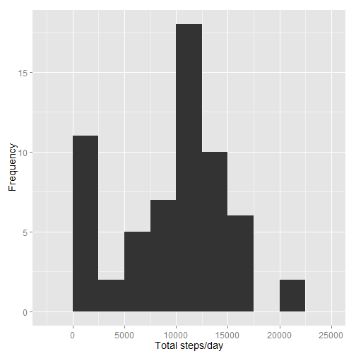
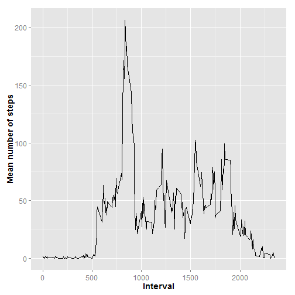
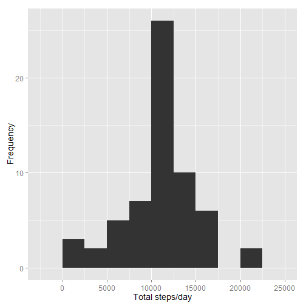
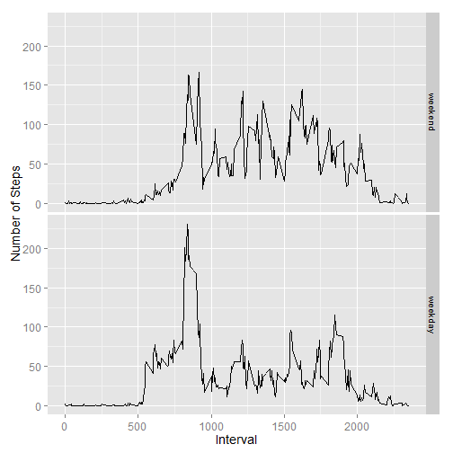

**Introduction**

*It is now possible to collect a large amount of data about personal movement using activity monitoring devices such as a Fitbit, Nike Fuelband, or Jawbone Up. These type of devices are part of the "quantified self" movement - a group of enthusiasts who take measurements about themselves regularly to improve their health, to find patterns in their behavior, or because they are tech geeks. But these data remain under-utilized both because the raw data are hard to obtain and there is a lack of statistical methods and software for processing and interpreting the data.*


*This project makes use of data from a personal activity monitoring device. This device collects data at 5 minute intervals through out the day. The data consists of two months of data from an anonymous individual collected during the months of October and November, 2012 and include the number of steps taken in 5 minute intervals each day. In the report, we try to answer the following questions:
    What is mean total number of steps taken per day?
    What is the average daily activity pattern?
    Are there differences in activity patterns between weekdays and weekends?*

where the file needs to be downloaded, unzipped, both or is otherwise present in the root directory where the .Rmd file is located. 

```r
if(file.exists("./activity.csv")){
  print("Dataset already downloaded and unzipped")
  print("Loading Data...")
}else if(file.exists("./repdata-data-activity.zip")){
  print("Dataset downloaded. Now Unzipping...")
  unzip("./repdata-data-activity.zip")
  print("Completed.")
  print("Loading Data...")
}else if(!file.exists("./repdata-data-activity.zip")){
  print("Downloading and unzipping dataset...")
  download.file("http://d396qusza40orc.cloudfront.net/repdata%2Fdata%2Factivity.zip","./repdata-data-activity.zip")
  unzip("./repdata-data-activity.zip")
  print("Completed.")
  print("Loading Data...")
}
```

```
## [1] "Dataset already downloaded and unzipped"
## [1] "Loading Data..."
```
First, we read the date converting the date column to character rather than factor.

```r
#read file using read.csv
activityData<-read.csv("./activity.csv", header=TRUE, sep=",")
#convert date column from factor to Date class
activityData$date<-as.Date(activityData$date)
#provide a summary of the activityData table
summary(activityData)
```

```
##      steps             date               interval     
##  Min.   :  0.00   Min.   :2012-10-01   Min.   :   0.0  
##  1st Qu.:  0.00   1st Qu.:2012-10-16   1st Qu.: 588.8  
##  Median :  0.00   Median :2012-10-31   Median :1177.5  
##  Mean   : 37.38   Mean   :2012-10-31   Mean   :1177.5  
##  3rd Qu.: 12.00   3rd Qu.:2012-11-15   3rd Qu.:1766.2  
##  Max.   :806.00   Max.   :2012-11-30   Max.   :2355.0  
##  NA's   :2304
```
Let's check the dimensions and a few rows of our newly created data frame

```r
dim(activityData)
```

```
## [1] 17568     3
```

```r
head(activityData)
```

```
##   steps       date interval
## 1    NA 2012-10-01        0
## 2    NA 2012-10-01        5
## 3    NA 2012-10-01       10
## 4    NA 2012-10-01       15
## 5    NA 2012-10-01       20
## 6    NA 2012-10-01       25
```
**Data Analysis**
**1. What is the mean total number of steps taken per day?**

```r
library (dplyr)
AvgDay <- activityData %>% group_by(date) %>%
  summarize(total.steps = sum(steps, na.rm = T),
          mean.steps = mean(steps, na.rm = T))

#Once the summaries are calculated, we can construct the histogram of the total steps:
  
library(ggplot2)
g <- ggplot(AvgDay, aes(x=total.steps))
g + geom_histogram(binwidth = 2500) + theme(axis.text = element_text(size = 12),axis.title = element_text(size = 14)) + labs(y = "Frequency") + labs(x = "Total steps/day")
```

 

```r
summary(AvgDay$total.steps)
```

```
##    Min. 1st Qu.  Median    Mean 3rd Qu.    Max. 
##       0    6778   10400    9354   12810   21190
```

```r
summary (AvgDay$mean.steps)
```

```
##    Min. 1st Qu.  Median    Mean 3rd Qu.    Max.    NA's 
##  0.1424 30.7000 37.3800 37.3800 46.1600 73.5900       8
```
**2. What is the daily activity pattern?**

```r
AvgInterval <- activityData %>% group_by(interval) %>%
summarize(mean.steps = mean(steps, na.rm = T))
g <- ggplot(AvgInterval, aes(x = interval, y = mean.steps))
g + geom_line() + theme(axis.text = element_text(size = 12), 
                        axis.title = element_text(size = 14, face = "bold")) + 
  labs(y = "Mean number of steps") + labs(x = "Interval")
```

 
It is observed that the largest amount of steps occurs between time intervals 500 and 1000. The maximum average number of steps is: 206 and occurs in time interval 835

**3. Imputing missing values**

```r
mean(is.na(activityData$steps))
```

```
## [1] 0.1311475
```

```r
sum(is.na(activityData$steps))
```

```
## [1] 2304
```
About 13% of the data is missing. In order to evaluate the effect of filling in NAs with estimated values we will create a new dataset and then perform a comparison.
First, we will check for missing values in the interval column within 

```r
#AvgInterval, where we stored the mean number of steps for each 5 min interval:
sum(is.na(AvgInterval$mean.steps))
```

```
## [1] 0
```
Since there are no missing values in this variable we will use it to fill in for NAs. Next we create a duplicate of the original data named newData and we will draw the appropriate values AvgInterval:

```r
newData <- activityData
```
The activity profiles between weekdays and weekends greatly differ. During the weekdays, activity peaks in the morning between 7 and 9 and then the activity remains below ~100 steps. In contrast, the weekend data does not show a period with particularly high level of activity, but the activity remains higher than the weekday activity at most times and in several instances it surpases the 100 steps mark and it is overall more evenly distributed throughout the day.

In order to fill in missing values we check at each row if the column interval is NA, when the condition is true we look for the corresponding interval (index), we search for this particular interval in the AvgInterval data and extract it to a temporary variable values. Last we choose only the column of interest from values, which is the mean.steps and assign this number to the corresponding position in the newData set. We use a for loop to run through all the rows. 


```r
for (i in 1:nrow(newData)) {
  if (is.na(newData$steps[i])) {
    index <- newData$interval[i]
    value <- subset(AvgInterval, interval==index)
    newData$steps[i] <- value$mean.steps
  }
}
head(newData)
```

```
##       steps       date interval
## 1 1.7169811 2012-10-01        0
## 2 0.3396226 2012-10-01        5
## 3 0.1320755 2012-10-01       10
## 4 0.1509434 2012-10-01       15
## 5 0.0754717 2012-10-01       20
## 6 2.0943396 2012-10-01       25
```
We can observe from the previous output that now there are numeric values in the first rows of the dataset.We use a similar method as before to group the data by date and calculate daily totals:

```r
newAvg <- newData %>% group_by(date) %>%
summarize(total.steps = sum(steps, na.rm = T))
```
And we can construct the histogram:

```r
g <- ggplot(newAvg, aes(x=total.steps))
g + geom_histogram(binwidth = 2500) + theme(axis.text = element_text(size = 12),
                                            axis.title = element_text(size = 14)) + labs(y = "Frequency") + labs(x = "Total steps/day")
```

 

For a more quantitative comparison lets review the 5 number summaries and standard deviations of the original data AvgDay vs the data with the imputed values newData.


```r
summary (AvgDay$total.steps)
```

```
##    Min. 1st Qu.  Median    Mean 3rd Qu.    Max. 
##       0    6778   10400    9354   12810   21190
```

```r
sd(AvgDay$total.steps, na.rm=T)
```

```
## [1] 5405.895
```

```r
summary (newAvg$total.steps)
```

```
##    Min. 1st Qu.  Median    Mean 3rd Qu.    Max. 
##      41    9819   10770   10770   12810   21190
```

```r
sd(newAvg$total.steps, na.rm=T)
```

```
## [1] 3974.391
```
**4. Are there differences in activity patterns between weekdays and weekends?**

Different weekend vs weekday patterns are expected as people, in general, have a different set of activities on weekends.In order to find the specific patterns for each set of days, we will identify the weekdays from the weekend data. First, we create a new column in newData containing the values weekend or weekday:


```r
newData$day <- ifelse(weekdays(newData$date) %in% c("Saturday", "Sunday"), "weekend", "weekday")

#Next we create two subsets, one containing the weekend and one containing the weekday data:
wkend <- filter(newData, day == "weekend")
wkday <- filter(newData, day == "weekday")
```
Then, similarly to section 2, we group by the intervals and calculate the mean number of steps for each time interval. Since the day column is lots during the grouping, we add it again to the wkend and wday dataframes. Lastly, we merge both data sets into one named newInterval.


```r
wkend <- wkend %>%
  group_by(interval) %>%
  summarize(mean.steps = mean(steps)) 
wkend$day <- "weekend"

wkday <- wkday %>%
  group_by(interval) %>%
  summarize(mean.steps = mean(steps)) 
wkday$day <- "weekday"

newInterval <- rbind(wkend, wkday)
newInterval$day <- as.factor(newInterval$day)
newInterval$day <- relevel(newInterval$day, "weekend")
```

The two panel plot is now created, using the day column as a factor to spearate the weekday from the weekend timeseries.

```r
g <- ggplot (newInterval, aes (interval, mean.steps))
g + geom_line() + facet_grid (day~.) + theme(axis.text = element_text(size = 12), 
  axis.title = element_text(size = 14)) + labs(y = "Number of Steps") + labs(x = "Interval")
```

 

The activity profiles between weekdays and weekends greatly differ. During the weekdays, activity peaks in the morning between 7 and 9 and then the activity remains below ~100 steps. In contrast, the weekend data does not show a period with particularly high level of activity, but the activity remains higher than the weekday activity at most times and in several instances it surpases the 100 steps mark and it is overall more evenly distributed throughout the day. 
